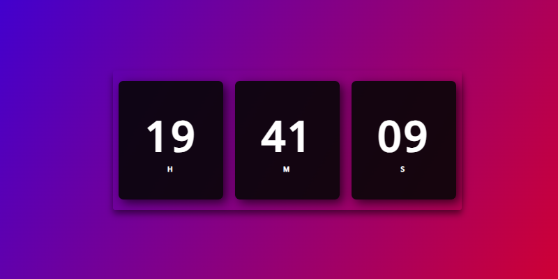
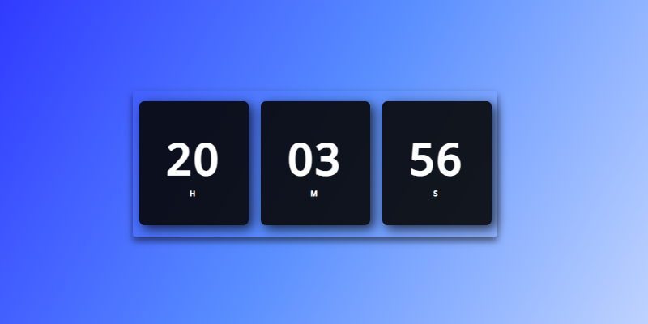

# TicTech ⌚📱

  ## About the project📜
Also exploring the frontend world, this project depicts a Digital Clock made in 
JavaScript, HTML5 and CSS3 that displays the current hours, minutes and seconds through the 'Date' class.

## Technologies used 💻⚙️ 
- JavaScript
- CSS3
- HTML5
- Visual Studio Code

## Project example

<p align = "center"> 
  
</p>

 ```bash
I confess.. it's pretty cool to be playing with the CSS
```
<p align = "center"> 
  
</p>

## Use the project yourself
You just need to clone the repository and open 'index.html' in your browser.
